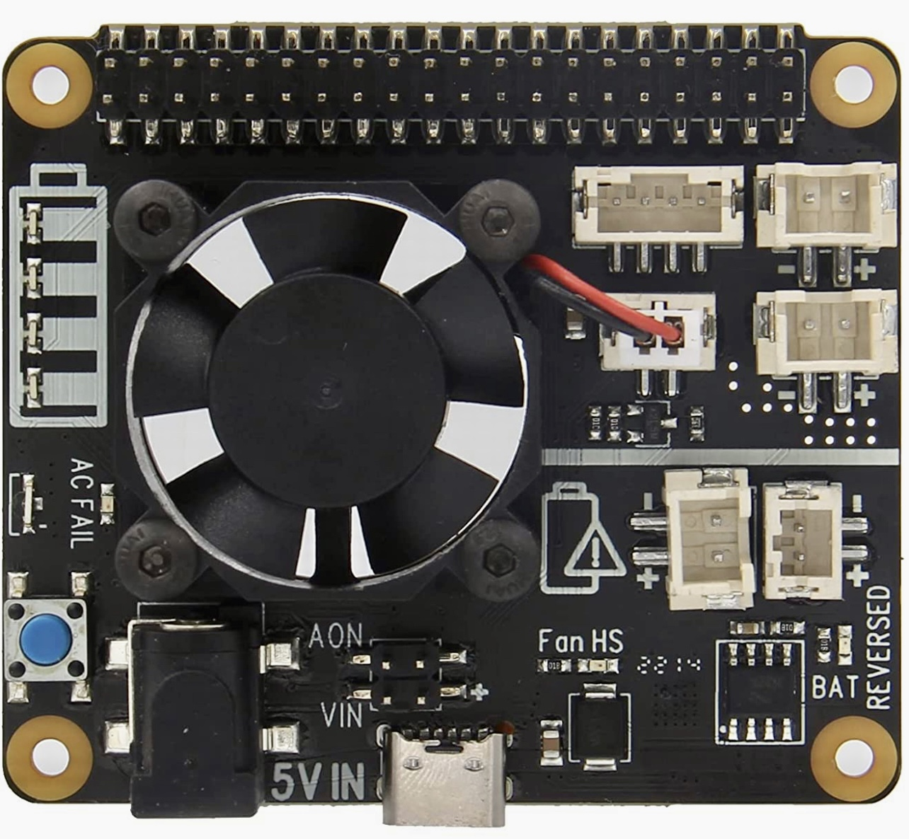

# x708v2

Forked from https://github.com/geekworm-com/x708v2

 

## Hardware

* Raspberry Pi 4 8GB
* Geekworm x728-C1 case
* Geekworm x708 hat
* Geekworm x708 UPS

## Software

### bat.py

Monitor battery capacity and voltage. The `Raspberrypi` is turned off if the battery is less than 20%
charged or the capacity is less than 3.0V.

`bat_test.py` can be used to test `bat.py`.

Use `create-bat.service.sh` to create the service to start the `bat.py` script after reboot.


```bash
sudo systemctl status x708-bat.service
● x708-bat.service - x708 Battery service
     Loaded: loaded (/lib/systemd/system/x708-bat.service; enabled; vendor preset: enabled)
     Active: active (running) since Sun 2022-10-02 20:02:18 CDT; 20h ago
   Main PID: 705 (python)
      Tasks: 1 (limit: 9046)
        CPU: 3.627s
     CGroup: /system.slice/x708-bat.service
             └─705 /usr/bin/python /home/pi/x708v2/raspberry-pi-os/bat.py

Oct 02 20:02:18 raspberrypi systemd[1]: Started x708 Battery service.
```

The bat.py log generated is saved in `x708.log`:

```bash
tail -f x708v2/raspberry-pi-os/x708.log
2022-10-09 16:39:24,660 - bat - INFO - Battery capacity:    19%
2022-10-09 16:39:29,668 - bat - INFO - Battery capacity:    19%
2022-10-09 16:39:34,676 - bat - INFO - Battery capacity:    19%
2022-10-09 16:39:39,685 - bat - INFO - Battery capacity:    19%
2022-10-09 16:39:44,695 - bat - INFO - Battery capacity:    19%
2022-10-09 16:39:49,700 - bat - INFO - Battery capacity:    19%
2022-10-09 16:39:54,708 - bat - INFO - Battery capacity:    19%
2022-10-09 16:39:59,717 - bat - INFO - Battery capacity:    19%
2022-10-09 16:40:04,724 - bat - INFO - Battery capacity:    19%
2022-10-09 16:40:09,732 - bat - INFO - Battery capacity:    19%
2022-10-09 16:40:14,740 - bat - INFO - Battery capacity:    19%
```

### fan.py

Monitor the `Raspberrypi` temperature is less than minimum threashold or greater that maximum threashold.
Notice tha `x708` fan board is `on` by default, no chance to power off, and the script only control
the fan speed.

Use `create-fan.service.sh` to create the service to start the `fan.py` script after reboot.

```bash
sudo systemctl status x708-fan.service
● x708-fan.service - x708 Fan service
     Loaded: loaded (/lib/systemd/system/x708-fan.service; enabled; vendor preset: enabled)
     Active: active (running) since Sun 2022-10-02 20:02:18 CDT; 20h ago
   Main PID: 706 (python)
      Tasks: 1 (limit: 9046)
        CPU: 3min 12.847s
     CGroup: /system.slice/x708-fan.service
             └─706 /usr/bin/python /home/pi/x708v2/raspberry-pi-os/fan.py

Oct 02 20:02:18 raspberrypi systemd[1]: Started x708 Fan service.
```

### Case power button

`pwr.sh` is the script for power management via case button.


## References

* [Raspberry Pi 4](https://www.raspberrypi.com/products/raspberry-pi-4-model-b/)
* [x708](https://wiki.geekworm.com/X708?TheOrder=1)
* [x708 software](https://wiki.geekworm.com/X708-Software)
* [x708 hardware](https://wiki.geekworm.com/X708-Hardware)
